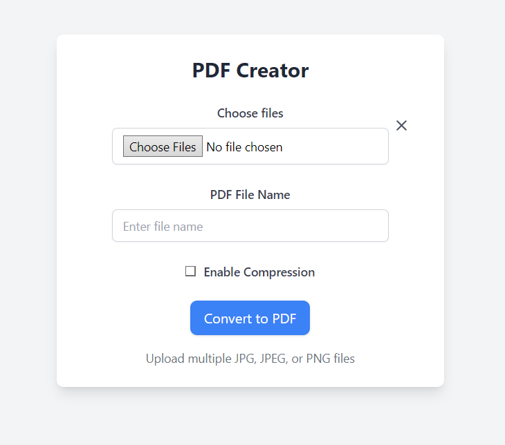

# PDFCreator: Convert Images to PDFs with Ease 🚀

**PDFCreator** is a lightweight and easy-to-use Flask-based web application that allows users to upload multiple images (JPEG, PNG) and convert them into a single PDF document. The app also supports optional compression to reduce file size.



## Features
- **Batch Image Upload**: Upload multiple images at once for seamless PDF creation.
- **Custom PDF Naming**: Specify a custom name for your generated PDF.
- **Optional Compression**: Reduce image sizes with adaptive palette-based compression.
- **Natural Sorting**: Automatically orders images for proper sequencing in the PDF.
- **User-Friendly Interface**: Simple and intuitive design for effortless usage.

## Technologies Used
- **Flask**: A lightweight web framework for building the app.
- **Pillow (PIL)**: For image manipulation and PDF generation.
- **natsort**: For natural sorting of file names to maintain order.

## Getting Started

### Prerequisites
Ensure you have the following installed:
- Python 3.7+
- Pip (Python package manager)

### Installation
1. Clone the repository:
   ```bash
   git clone https://github.com/yourusername/PDFCreator.git
   ```
2. Navigate to the project directory:
   ```bash
   cd PDFCreator
   ```
3. Install the required dependencies:
   ```bash
   pip install -r requirements.txt
   ```

### Running the Application
1. Start the application:
   ```bash
   python app.py
   ```
2. Open your browser and visit:
   ```
   http://127.0.0.1:5000
   ```

## Usage
1. **Upload Images**: Select one or more images (JPEG, PNG) to upload.
2. **Set PDF Name**: Enter a custom name for the generated PDF (optional).
3. **Enable Compression**: Check the box to reduce file size (optional).
4. **Generate PDF**: Click the upload button and download your generated PDF!


## License
This project is licensed under the MIT License. See the [LICENSE](LICENSE) file for more details.

---

**Happy PDF Creating!**